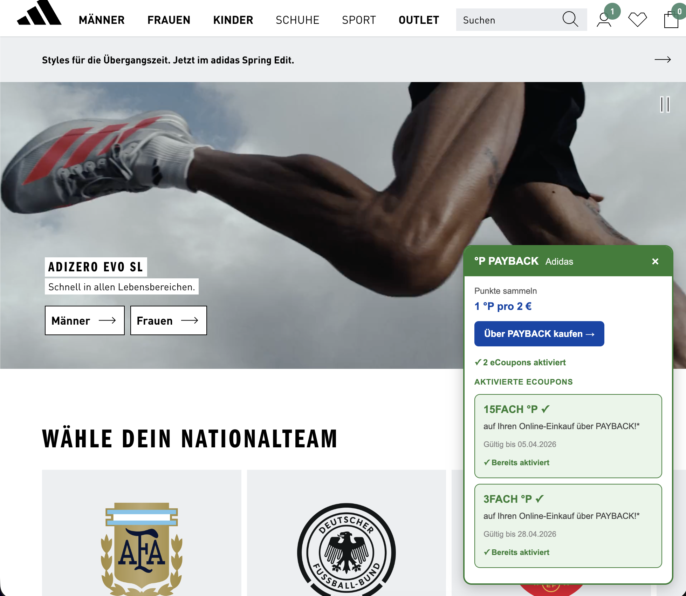
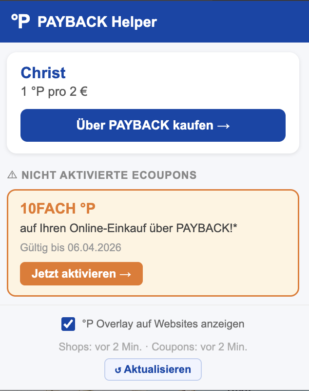

# PAYBACK Helper
A Chrome Extension that shows your link for PAYBACK points as well as eCoupons for the website you are currently browsing. Works for PAYBACK.at (Austria).

## Features
- Shows the **°P points** for the current shop when you visit a PAYBACK partner website
- Shows your **eCoupons** (activated and not yet activated) for that shop
- **Overlay widget** on partner websites with a one-click link to purchase via PAYBACK
- Warns you about **unactivated eCoupons** before you shop
- Auto-redirects to the PAYBACK affiliate URL when clicking "Über PAYBACK kaufen"
- Displays your current **°Punkte balance** in the popup
- **Refresh button** to update shops and coupons in the background

## How To Install (Chrome)

> This is an unpacked (developer) install.

1. Download the repo: **Code → Download ZIP**, then unzip

2. Open Chrome's Extensions page: `chrome://extensions`

3. Turn on **Developer mode** (top-right).

4. Click **Load unpacked** and select the folder that contains `manifest.json`.

5. (Optional) Pin it: click the puzzle-piece **Extensions** icon → **Pin**.

### Update after pulling new changes
Go back to `chrome://extensions` and click **Reload** on the extension card.
The folder must remain, once it is deleted, the extension will not work anymore.

### First Use
After installing, click **↺ Aktualisieren** in the popup. This opens two background tabs on payback.at to fetch your shop list and eCoupons. You need to be logged in on payback.at for eCoupons to load.

## Images

